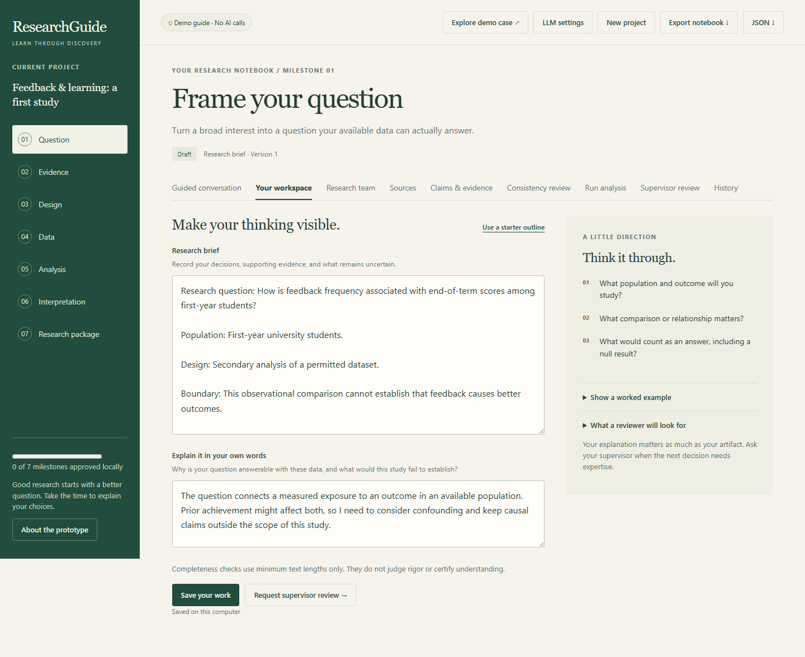

# ResearchGuide

**Your first rigorous study, one thoughtful step at a time.**

ResearchGuide is an early, local-first prototype for beginning PhD students and their supervisors. Move from a research question to a complete notebook of decisions, evidence, analysis records, and interpretations. Each milestone pairs something you make with an explanation of why you made it.



## Run locally

Requires **Node.js 22.13 or newer**. Run `npm ci` once to install the pinned PDF.js, CSV parser, and webR dependencies. There is no build step.

```bash
npm ci
npm start
```

Open **http://127.0.0.1:3000**. The default demo works without an account, API key, or internet connection. It returns clearly labeled, deterministic milestone guidance; it is not an AI conversation.

This application intentionally listens on loopback only. It is a single-user local prototype, not a public web service. Publishing the source repository does not deploy the application.

## Start with a conversation

### Explore a complete fictional case

Choose **Explore demo case ↗** in the toolbar or use the demo link under **New project**. The walkthrough opens in a separate tab and keeps your current notebook, unsaved edits and model settings intact. It needs no API key and makes no AI calls.

Follow fictional PhD student Maya through all seven phases: question, evidence, design, data, analysis, interpretation and research package. Reveal the conversations exchange by exchange, inspect the accepted artifacts and explanations, and see how earlier decisions constrain later work. The example includes an unsupported causal claim, a challenging source, two missing records, explicit analysis approval, and a consistency finding followed by a corrected conclusion. Optional learning questions provide immediate feedback. Progress stays in browser storage; **Restart walkthrough** resets only that progress.

All people, source excerpts, conversations and reviews are authored simulations. The bundled regression outputs were computed by the app’s actual local R runner on eight synthetic records, using six complete cases. Download the walkthrough, CSV, exact R script, selected input, figure and reproduction bundle. The small invented case teaches workflow; it is not evidence about real students or a publication-ready study. The downloads are teaching/reproduction materials, not an active-notebook import.

Maintainers can regenerate the checked-in computation with `npm run build:demo`. This runs the fixed R template on synthetic data without reading the active notebook or model settings. Case content lives in `lib/demo-case.mjs`; the served artifact is `public/demo-case.json`. Run `node scripts/demo-smoke.mjs` with Playwright installed (or `PLAYWRIGHT_MODULE` configured) to verify the full walkthrough, downloads and notebook isolation.

### Work on your own project

New projects and milestones now open **Guided conversation**. Configure Ollama or a hosted API, then click **Start guiding me**, or type what you know. You do not need to fill in an artifact first.

The guide uses your project, saved work, sources, and earlier answers to choose a focused follow-up question. Later milestones carry forward earlier artifacts, explanations, review status, and the most recent 12 conversation turns per earlier milestone. The saved research brief takes precedence over the original project interest. Open “Carried forward” to inspect the earlier artifacts, then choose “Continue from earlier work”. Accepting a draft makes it available downstream; it does not grant supervisor approval. It explains gaps and can propose a complete milestone draft. Ask it to revise anything inaccurate, then click **Accept draft into notebook** when it reflects your decisions. Acceptance saves a versioned artifact; it preserves your own explanation and renews affected review requirements. Outdated proposals cannot overwrite newer artifacts.

Open **Your workspace** to explain the reasoning in your own words and request supervisor review. The conversational guide is available across all seven milestones; the original three-role feedback remains under **Research team**. Each conversational turn uses one model call with a validated structured response. It does not independently search, execute analyses, approve work, or certify rigor.

Conversations persist and are included in JSON and Markdown exports. Each milestone supports up to 60 turns; the full saved conversation for that milestone is sent to the configured provider on subsequent turns. Demo mode does not simulate adaptive conversation. Existing notebooks work without migration.

Example: tell the guide, “I want to study AI use and learning, but I only have course grades.” Explain whether AI use was measured. The guide should help determine whether the question is feasible, identify missing measures, and propose a revised brief for your review. Model suggestions still require critical assessment.

## Try the complete workflow

1. Choose **New project** and describe what you want to investigate.
2. In **Your workspace**, use the outline or write your own research brief. Explain your choices in your own words.
3. Open **Research team** and run the demo guide. Inspect the coordinator, specialist, reviewer, and next-step messages.
4. Save your work and request a supervisor review. The minimum lengths check completeness only, not rigor or understanding.
5. In **Supervisor review**, enter a name and a substantive note to approve or request changes. This is an explicitly labeled local role demonstration, not an authenticated supervisor account.
6. Continue to the evidence milestone and add a source URL, location, and passage you inspected. Sources are user-provided and unverified.
7. Work through design, data inspection, analysis, interpretation, and packaging. Export the saved notebook as Markdown or the complete record as JSON.

You can draft ahead, but submitting a milestone requires approvals on all preceding milestones. Changing an earlier artifact invalidates its approval and affected downstream statuses while preserving historical reviews. Adding evidence also triggers renewed review of the evidence milestone and its dependents.

## Trace a claim back to evidence

1. Open **Sources**. Upload a text-based PDF (up to 5 MB and 100 pages), or use the existing form to enter a source URL and an inspected passage. Source URLs are recorded, not automatically fetched.
2. For a PDF, select an extracted page, compare it with the original, and copy a short exact passage. **Save page-linked passage** checks that the quotation occurs in the normalized extracted page text. File-page numbers may differ from printed labels. Multi-column extraction can change reading order; scans need OCR elsewhere.
3. Open **Claims & evidence**. Write a specific claim and attach 1–8 source passages. Save the claim.
4. Click **Assess linked evidence**. The configured model receives only that claim and its linked passages. It suggests whether those excerpts support, limit, or contradict the claim and may propose narrower wording. Responses containing unknown source IDs are rejected. A supported verdict is not full-paper verification or proof of scientific truth.
5. Inspect the source context. Open **Record your inspection and decision**, explain your reasoning, and record agreement, disagreement, or unresolved status. This local researcher record is unauthenticated and does not grant supervisor approval.
6. Revise the claim if needed and reassess. Editing a claim preserves history but makes earlier assessments outdated. Evidence changes renew affected milestone reviews.

The claim ledger is included in research guidance and Markdown/JSON exports. Cite claim IDs such as C1 alongside passage IDs such as S1 in artifacts. The app checks claims you explicitly add; it does not automatically find every claim in your manuscript or validate the source's publication metadata. Manual passages remain labeled unverified.

PDF parsing is local and uses a worker with a 30-second timeout and a 256 MB JavaScript heap limit; this is not an operating-system sandbox. Limits are 10 papers, 500,000 extracted characters per paper, and two million per notebook. Each claim supports 20 assessment records, with 20 researcher decisions per assessment. Extraction uses [Mozilla PDF.js](https://mozilla.github.io/pdf.js/api/draft/module-pdfjsLib.html).

Original PDFs live in `data/papers/`, named by SHA-256. JSON exports include extracted pages and provenance, but not original PDF bytes. Back up `data/papers/` with the notebook to retain originals; creating a new project preserves files needed by archived notebooks. Uploaded papers are not automatically sent to an LLM. Selected excerpts are sent during claim assessment; guidance receives source records and the first 30 claim records.

## Check consistency across the study

Open **Consistency review** from any milestone and click **Run consistency review**. Save artifacts in at least two of the reviewed milestones first. The app compares the current research brief, design, data report, analysis record, interpretation (conclusions), and research package, including student explanations. It uses the saved research brief rather than the initial broad project interest. Unsaved workspace edits are saved before the request.

The model looks for mismatched populations or measurements, causal claims unsupported by the design, unexplained analysis-plan deviations, conclusions that conflict with estimates or uncertainty, and overstated generalizability. It returns up to six priority findings. Each mismatch must quote at least two different milestones, and the server verifies every quotation against the exact saved text. Missing question, design, analysis, or interpretation artifacts are explicitly listed as a partial review. No findings means no issue was identified by the model, not that the study is scientifically sound.

Inspect the quoted passages, open their linked milestone workspaces, and record agreement, disagreement, or unresolved status with your own explanation. A researcher response does not automatically fix a finding or grant supervisor approval. Edit the relevant artifacts and run a fresh review. Changes to any reviewed artifact or explanation make an old report outdated; unrelated source changes or recording a response do not. Decisions can be added only to the newest report while it still matches the saved work.

Reports preserve the reviewed text and versions, model information, findings, and local unauthenticated researcher responses. History remains visible and is included in Markdown/JSON exports. Conversational guidance receives the latest report, labeled current or outdated. Limits: 20 reports per notebook and 20 responses per finding. Each run makes one model call and sends the six milestone artifacts and explanations to the configured provider. It does not inspect external documents or independently rerun calculations. When available, it also compares the latest three recorded successful R output summaries; it does not guarantee an exhaustive audit.

## Run a reproducible analysis

Open **Run analysis** from any milestone. No native R or Docker installation is required: the pinned [webR runtime](https://docs.r-wasm.org/webr/latest/) runs R locally.

1. Import a permitted CSV and describe its license, permission, or synthetic origin. Limits: 2 MB, 2–10,000 rows, 1–50 uniquely named columns, and five dataset versions. The app records a SHA-256 of the stored UTF-8 CSV and profiles numeric values and missingness.
2. Ask the model to propose a plan, or choose one manually. Supported methods are descriptive statistics for one numeric outcome and unadjusted simple linear regression with one numeric predictor. Column profiles and the saved question/design/data text are sent for AI planning; row-level observations are not.
3. Review the rationale, variable mapping, missing-data policy, and exact generated R script. Blank cells and NA are treated as missing; complete-case omission is counted. Enter an explicit local execution approval with your reasoning. This is not an authenticated supervisor sign-off.
4. Run the approved plan. Only reviewed templates execute; AI responses cannot supply executable R. Changing the question, design, or data report requires a new plan and approval. Dataset, plan, and script hashes are checked before execution.
5. Inspect actual R tables, 95% regression intervals, fitted values/residuals, a histogram, execution log, and `sessionInfo()`. Failed runs have a failure record and are never shown as successful results. Regression does not establish causation, adjust for extra confounders, or automatically validate assumptions.
6. Download the reproduction bundle (JSON), or individual `analysis.R`, `input.csv`, tables, SVG, and session file. To rerun externally, save the script and normalized input in a clean directory and run `Rscript analysis.R`. The recorded R and package versions describe the original environment. Bundles include the original dataset, plan, approval record, and normalized numeric input; **they contain row-level data**.

Use run IDs such as R1 in the Analysis and Interpretation artifacts. Conversation and consistency review receive summaries of the latest three successful runs, labeled current or historical. Consistency findings can quote recorded execution output. Running a new analysis makes prior consistency reports outdated; no artifact is silently rewritten.

Each execution starts a separate short-lived Node/webR process with an in-memory R filesystem, no mounted host directories, and an empty inherited environment. Only a method enum and normalized numeric CSV are passed in; API keys and arbitrary R code are not passed. Limits: 30 seconds, bounded output, 256 MB V8 heap, and 512 MB per WebAssembly memory. These are not a total-process RAM quota or an operating-system sandbox for arbitrary code. No network calls or package installation are made by the fixed templates; dependencies and runtime assets are installed beforehand with npm. Do not extend the runner to accept free-form R without designing a stronger isolation boundary.

This release supports 30 plans and 30 run records per notebook. Advanced models, categorical predictors, imputation, arbitrary code, automated diagnostics interpretation, and native RStudio integration remain future work. Runtime licensing is documented in [THIRD_PARTY.md](THIRD_PARTY.md).

## Choose a local model or hosted API

Open **LLM settings** in the top bar. Choose:

- **Demo**: offline template guidance, no model required.
- **Ollama**: enter your installed model name and base URL (normally `http://127.0.0.1:11434`).
- **OpenAI-compatible API**: enter the provider's base URL, exact model ID, and API key. For OpenAI the base URL is `https://api.openai.com/v1`.

Click **Save model settings**, then **Test saved connection**. Changes apply immediately. The test sends only a short test prompt, without project content, and may incur a small provider charge. Saved keys are not returned to the browser; leaving the key blank retains it only for the same provider and endpoint. Use the removal checkbox to clear it.

The API adapter uses [Chat Completions](https://developers.openai.com/api/reference/resources/chat). Select `max_completion_tokens` for OpenAI or `max_tokens` if required by another compatible provider. Native Anthropic and Responses-only endpoints are not supported. API compatibility and model access depend on your provider. Ollama uses its [`/api/chat` endpoint](https://docs.ollama.com/api/chat).

Alternatively, copy `.env.example` to `.env` and configure startup defaults:

```dotenv
LLM_PROVIDER=openai-compatible
LLM_BASE_URL=https://api.openai.com/v1
LLM_MODEL=your-model-id
LLM_API_KEY=your-api-key
LLM_MAX_OUTPUT_TOKENS=4096
LLM_TOKEN_PARAMETER=max_completion_tokens
```

For Ollama, set `LLM_PROVIDER=ollama`, `LLM_BASE_URL=http://127.0.0.1:11434`, and `LLM_MODEL` to your installed model name. Existing configurations using `OLLAMA_MODEL` and `OLLAMA_URL` still work when `LLM_PROVIDER` is unset.

Settings saved in the UI override environment defaults on restart. They are stored in `data/model-settings.json`, separately from project exports and excluded from Git. This local file is **not encrypted**. To return to environment defaults, stop the server and remove that settings file. Switching to Demo clears the active saved key, but does not modify environment files or backups.

Each guidance run makes three sequential calls: a milestone specialist examines the saved context, a reviewer critiques its response, and a coordinator proposes the next task. Each call has a 90-second timeout and a configurable output limit. Failed or truncated responses are reported; a run is saved only after all calls succeed.

Project text and up to 20 source records are sent to your configured endpoint. Hosted API mode therefore processes research content with that provider. Remote endpoints require HTTPS; HTTP is accepted only on localhost. Endpoint redirects are not followed. Changing settings in another tab blocks guidance until the active provider is reviewed. The application does not provision, download, or train models.

## Implemented versus planned

| Available in v0.7                                            | Planned, not implemented                              |
| ------------------------------------------------------------ | ----------------------------------------------------- |
| Seven milestone templates and worked examples                | Validated adaptive teaching and competence assessment |
| Student explanations and supervisor checkpoints              | Authenticated roles and remote collaboration          |
| Deterministic workflow coordinator                           | Autonomous tool selection and bounded replanning      |
| Optional specialist/reviewer/coordinator model sequence      | Literature search and source verification             |
| PDF passages and claim assessments with researcher decisions | OCR, automated retrieval and full-paper verification  |
| Versioned artifacts and dependency invalidation              | Advanced models and unrestricted-code isolation       |
| Atomic local saves, history, Markdown/JSON export            | RStudio integration and institutional storage         |

This is a working foundation for an agentic research guide. It is not an autonomous scientist, a scientific-quality certification system, or a replacement for supervision. The initial guidance focuses on quantitative secondary-data studies. Basic CSV profiling and approved descriptive/simple-regression execution are available locally; other analyses are performed in the researcher's own tools and documented here.

## Architecture

```text
Browser workspace
  ├── artifact + student explanation
  ├── source records
  └── local review decisions
            │ same-origin JSON requests
Node HTTP server (loopback only)
  ├── workflow state machine → atomic JSON persistence
  ├── guide runner → deterministic demo OR Ollama / compatible API role sequence
  └── versioned notebook export
```

- `lib/analysis.mjs` and `lib/r-*.mjs`: CSV profiles, bound plans/approvals, fixed R templates, and bounded local execution.
- `lib/consistency.mjs`: cross-milestone comparisons, exact-quotation checks, and version-bound researcher responses.
- `lib/evidence.mjs` and `lib/pdf-worker.mjs`: local PDF extraction, page matching, and bounded claim assessments.
- `lib/workflow.mjs`: milestone definitions, transitions, approval gates, invalidation, and export.
- `lib/conversation.mjs`: persistent conversational guidance and validated artifact proposals.
- `lib/guide.mjs`: transparent guidance traces and optional model orchestration.
- `lib/llm.mjs`: provider adapters, configuration validation, and masked settings.
- `server.mjs`: request validation, concurrency controls, persistence, and static serving.
- `public/`: responsive, accessible browser interface with no framework dependency.
- `test/`: workflow, server, persistence, concurrency, and mocked-provider tests.

No arbitrary code execution or automatic external publication is implemented. Browser content is rendered with text nodes rather than interpreted HTML. The server uses a strict static-file allowlist, request-size limits, origin/host checks, and a content security policy.

## Data and backup

The active project is stored in `data/project.json`. Creating a new project archives the previous one in the same directory; the interface currently opens only the active project. `data/` and `.env` are excluded from Git. This local storage is not encrypted and its activity log is not tamper-proof.

Use **JSON export** to back up your project. To restore, stop the server, back up the current file, replace `data/project.json` with an unmodified export from this version, and restart. Do not load arbitrary or edited project files. A browser-based import flow and migrations are future work. The server fails on unreadable or unsupported saved data instead of overwriting it.

Set `RESEARCHGUIDE_DATA_DIR` to an absolute directory path to store projects elsewhere. Backups, archives, and model-server records are outside the UI's lifecycle; manage them on your computer. Do not use this release for restricted participant data or authenticated institutional review.

## Development and verification

```bash
npm run dev
npm run check
npm test
```

Tests use Node's built-in runner. CI runs syntax and unit/integration checks on Windows and Ubuntu with Node 22 and 24.

The optional browser smoke test requires Playwright and Chromium:

```bash
npm install --no-save --package-lock=false playwright
npx playwright install chromium
node scripts/browser-smoke.mjs
node scripts/settings-smoke.mjs
node scripts/evidence-smoke.mjs
node scripts/consistency-smoke.mjs
node scripts/analysis-smoke.mjs
```

It uses temporary data, walks project creation through review, checks export and revision invalidation, verifies mobile overflow, and regenerates the screenshots. The settings smoke test checks provider configuration, masked keys, connection testing, and guidance against a mock API; no real API credentials are required. Browser checks are not currently included in CI. `PLAYWRIGHT_MODULE` can point to an existing Playwright module URL instead of installing it here.

## Contributing

See [CONTRIBUTING.md](CONTRIBUTING.md), [the roadmap](docs/ROADMAP.md), and [security and data boundaries](SECURITY.md). The most useful early contributions are novice-researcher interviews, supervisor review of the milestone prompts, tests of failure cases, and integrations supported by real research workflows.

OpenMAIC inspired the director-and-specialist interaction pattern. This is an independent implementation; no OpenMAIC code, assets, or branding are included, and no affiliation is claimed.

## License

[MIT](LICENSE). ResearchGuide is a working project name, not a claim of trademark clearance.
