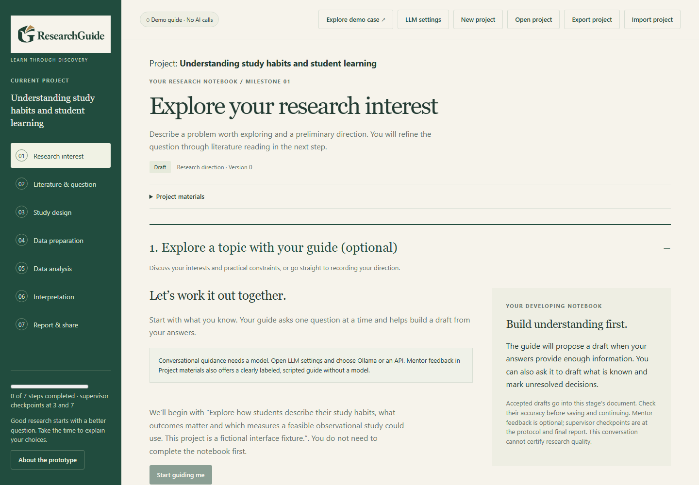
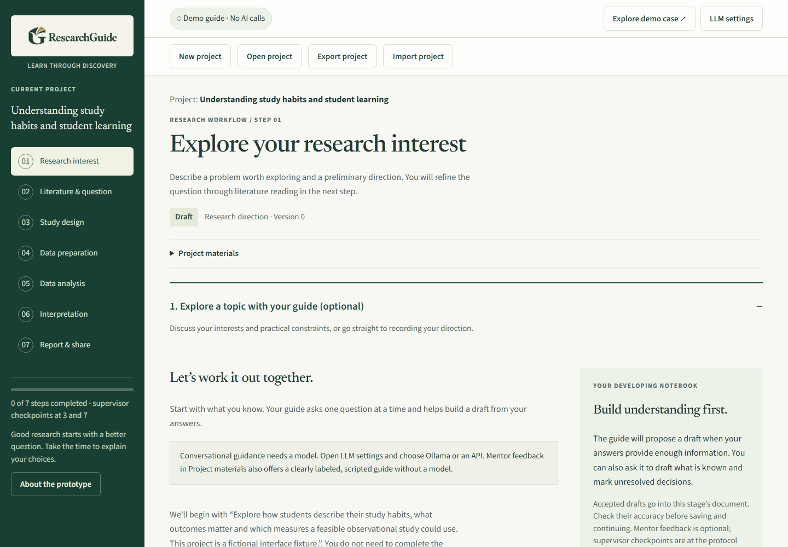
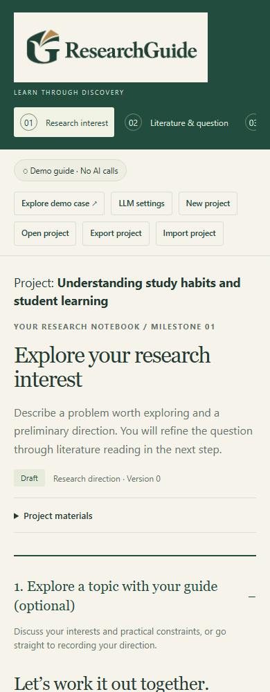
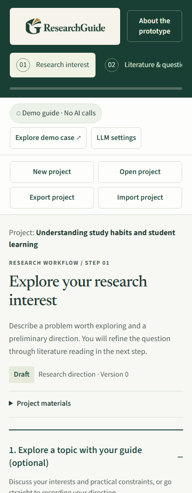

# Interface review and visual refinement

Reviewed and implemented 2026-09-09. Screenshots and automated checks use an isolated fictional project; no user's research records or model credentials are included.

## Design verdict

The original interface already had a coherent scholarly palette and a useful sequential workflow. It did not rely on gradients, decorative metrics or a wall of cards. However, very small controls, a dense utility toolbar and inconsistent heading sizes gave parts of it a prototype appearance. The refinement keeps the research sequence and adopts a restrained editorial style: Newsreader headings, Source Sans 3 body text, forest-green navigation and light reading surfaces.

## Findings and completed work

Ten actionable findings: **0 critical, 1 high, 7 medium, 2 low**. Priorities below describe the original implementation. All ten have been addressed in this change; this is a targeted engineering review, not a certification of complete accessibility conformance.

| Priority                       | Location                                                        | Finding and user impact                                                                                                                                                                        | Implemented response                                                                                                                                                                                                                                                                    |
| ------------------------------ | --------------------------------------------------------------- | ---------------------------------------------------------------------------------------------------------------------------------------------------------------------------------------------- | --------------------------------------------------------------------------------------------------------------------------------------------------------------------------------------------------------------------------------------------------------------------------------------- |
| High · accessibility           | `public/style.css`: input, select and textarea borders          | Pale input boundaries had insufficient contrast against their field background where the boundary identifies the control (WCAG 1.4.11 consideration).                                          | Darker field border, measured at 3.12:1 against the field surface; focus ring is separately visible.                                                                                                                                                                                    |
| Medium · readability           | `.small`, `.help`, `.field`, `.button`, status and history text | Common supporting text was around 12–13px, making instructions and decisions unnecessarily hard to read.                                                                                       | Body and input text are 16px; most supporting text and controls are 15px. Only short section labels use 12px. Fonts are locally served with system fallbacks.                                                                                                                           |
| Medium · touch usability       | Buttons, text buttons and summaries                             | 90 of the 91 baseline states contained visible buttons below the preferred 44px target height. This is a usability finding, not a claim that every button failed WCAG's separate 24px minimum. | Buttons have a 44px minimum height, stage links 48px, and disclosure summaries a 44px minimum. The 137 final checked states contain no buttons below the test's 43px tolerance.                                                                                                         |
| Medium · navigation            | `topbar()` in `public/app.js`                                   | Model configuration, demonstrations and four project actions competed in one toolbar and wrapped inconsistently.                                                                               | Separate service and project-action rows; a labeled project navigation landmark; a two-column project-action layout on small phones. All existing actions remain available.                                                                                                             |
| Medium · visual hierarchy      | Page headings, task headings, nested panels                     | Large serif headings at several levels competed with the task sequence and forms.                                                                                                              | Fluid page headings capped at 44px, 26px panel headings and approximately 19px semibold sans-serif task headings. Project titles stay visible at the start of each step.                                                                                                                |
| Medium · responsive navigation | `.sidebar`                                                      | A sticky viewport-height sidebar had no independent overflow handling, risking inaccessible lower content on short screens.                                                                    | Scrollable desktop sidebar verified at a 600px viewport height. Mobile navigation becomes a compact horizontal step strip; duplicated title/tagline/footer prose is omitted there while the title remains in the step header, progress remains accessible, and About remains available. |
| Medium · visual consistency    | Progress, forms, quotes, tables and secondary panels            | Browser-default progress styling and inconsistent surfaces weakened the visual hierarchy.                                                                                                      | Styled progress, consistent field padding, calm guidance surfaces, clearer table headings and numeric alignment, and restrained borders and corner radii.                                                                                                                               |
| Medium · keyboard usability    | Analysis tables, code blocks and skip link                      | Scroll regions had no explicit keyboard focus target, and the main landmark was not explicitly focusable.                                                                                      | Named, focusable table/code regions and a programmatically focusable main landmark. Skip-link keyboard navigation and reduced-motion behavior are checked.                                                                                                                              |
| Low · loading stability        | Brand image and typography                                      | The logo had no reserved aspect ratio; adding remote fonts could create an unwanted network dependency.                                                                                        | Reserved logo proportions and locally stored, preloaded WOFF2 fonts with `font-display: swap`. Original logo asset preserved; font licences included.                                                                                                                                   |
| Low · export presentation      | Print styles                                                    | Browser printing included app navigation and controls.                                                                                                                                         | Print rules remove sidebar and topbar chrome and give the research content a simple reading layout. Dedicated project export remains the preferred complete handoff.                                                                                                                    |

## Systemic changes

Typography, colors and corner radius now have shared tokens. Layout spacing follows a smaller set of intervals, task headings have a consistent role, and guidance is visually subordinate to the research work. No new required workflow fields, approval steps, AI calls or external browser dependencies were introduced.

Representative contrast checks: muted text on the main surface **5.76:1**; field border on its background **3.12:1**; focus color on the main surface **4.68:1**; sidebar supporting text **7.87:1**. These checks cover key design tokens, not every possible content/background combination.

## Positive findings preserved

- All visible fields in the audited states already had label associations; those remain intact.
- Baseline states did not show horizontal page overflow; the new design retains that behavior despite larger controls.
- Semantic buttons, disclosure elements, the skip link and reduced-motion support provided a sound starting point.
- The shared research workflow, saved drafts, project isolation and demo disclosure remain intact.
- Content Security Policy remains restrictive. Local fonts load through explicit static routes; no inline-style exception or external font permission was added.

## Verification

- **137 interface states**, including all seven steps, shared research tools, project management pages, settings and both demos, at 1440, 1024, 768, 390 and 320px widths.
- 200% root text enlargement; a 160-character unbroken title and long model name; desktop sidebar access at 600px height.
- No horizontal page overflow, undersized visible buttons or unlabeled visible form fields in those final states.
- Fonts load locally; keyboard skip link and reduced-motion checks pass.
- **63 unit/integration tests** pass.
- Existing workflow, settings, project-management and both demo browser smoke checks pass.

The new interface smoke check is `scripts/interface-smoke.mjs`; it runs against a temporary synthetic project. It does not read the running app's project or settings. Recorded baseline metrics cover 91 states; the final suite adds shared tools and long-content checks. Screenshot directories are `docs/images/interface-before` and `docs/images/interface-after`.

## Visual comparison

| Before                                                            | After                                                           |
| ----------------------------------------------------------------- | --------------------------------------------------------------- |
|  |  |
|    |    |

## Follow-up priorities

No identified blocker remains from this pass. Future additions should use the shared typography and control styles (`normalize`), receive responsive checks (`adapt`), and finish with visual inspection (`polish`). Periodic `audit` reviews should include manual screen-reader and real-device checks; these were not performed here. Dark mode is not currently offered and was not introduced by this change.
